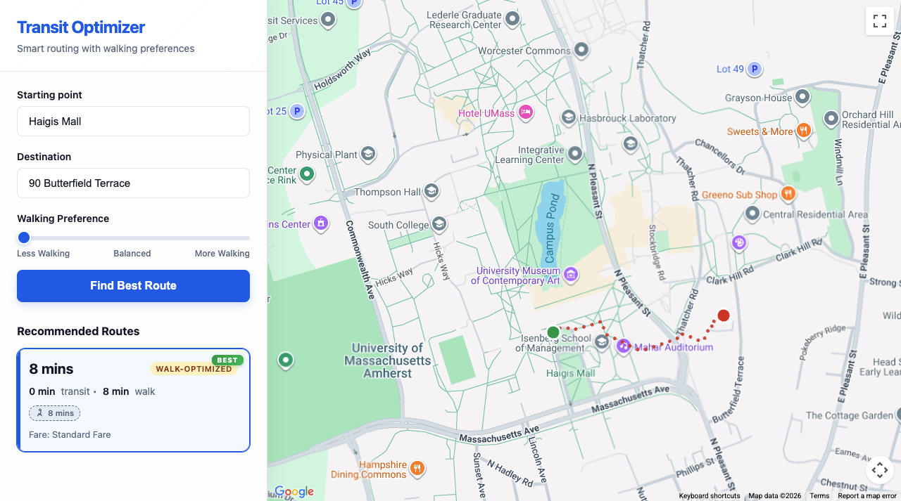
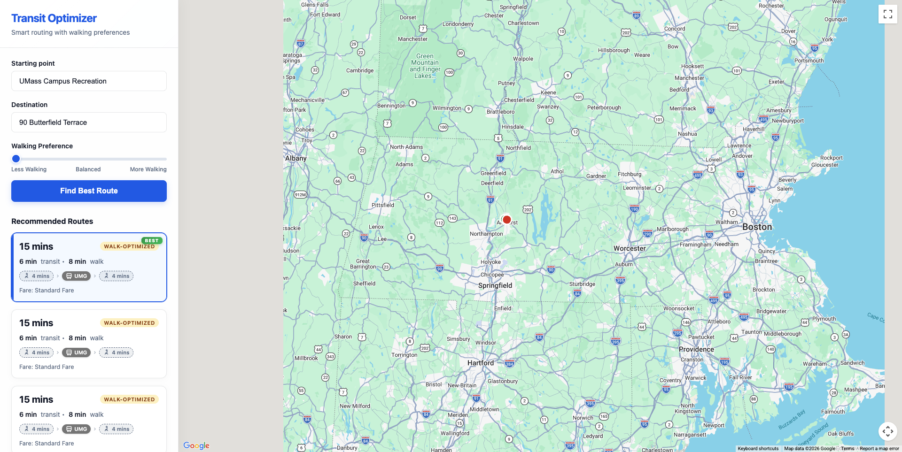

# 🚌 Legit Transit

A smart public transit routing web application that helps users find the best route between two locations, with a unique **Walking Preference** feature that lets users balance transit time against walking distance.

## Purpose

Google Maps provides transit directions, but doesn't let users easily control how much walking they're willing to do. This app fills that gap — users can slide between "Less Walking" (prioritize transit-heavy routes) and "More Walking" (walk-optimized routes that may be faster or healthier), and the app ranks results accordingly.

### Example: "Less Walking" Preference

Below is an example routing from **Alexandria** to **2221 S Clark St** with the walking preference set toward *Less Walking*. The app prioritizes transit-heavy routes, showing bold red lines for transit segments, dotted red lines for walking, and circle markers at station stops.



### Example: "More Walking" Preference

The same route with the slider set toward *More Walking*. The app now ranks the walk-optimized 41-min route first (32 min walk, 9 min transit), showing a longer walking path on the map.



### Key Features

- **Smart Route Ranking** — Routes are sorted using a weighted cost function based on the user's walking preference slider (less walking → balanced → more walking).
- **Multiple Route Options** — Requests alternative transit routes from the Google Directions API and presents them as selectable cards with the best option highlighted.
- **Step-by-Step Breakdown** — Each route card shows a visual summary of transit lines (with line colors and names) and walking segments as compact chips.
- **Custom Map Rendering** — Selected routes are drawn on the map with distinct visual styles:
  - **Bold solid red lines** for public transit segments
  - **Dotted red lines** for walking segments
  - **Large circle markers** at every transit station stop
  - **Green/Red markers** for origin and destination
- **Place Autocomplete** — Google Places Autocomplete on both input fields for fast, accurate location entry.

## Tech Stack

| Technology | Purpose |
|---|---|
| [React](https://react.dev/) `19.x` | UI framework and component architecture |
| [TypeScript](https://www.typescriptlang.org/) `5.9` | Type-safe development |
| [Vite](https://vite.dev/) `5.x` | Build tool and dev server with HMR |
| [@vis.gl/react-google-maps](https://visgl.github.io/react-google-maps/) `1.7` | React bindings for Google Maps JavaScript API |
| [Google Maps JavaScript API](https://developers.google.com/maps/documentation/javascript) | Map rendering, Directions Service, Places Autocomplete |
| Vanilla CSS | Styling with glassmorphism, custom slider, and animations |

### Google Maps APIs Used

- **Maps JavaScript API** — Interactive map display
- **Directions API** — Transit route calculation with alternatives
- **Places API** — Autocomplete for origin/destination inputs

## Project Structure

```
src/
├── App.tsx                    # Root component, route calculation logic, state management
├── App.css                    # App-level style overrides
├── index.css                  # Global design system (glassmorphism, cards, chips, animations)
├── main.tsx                   # React entry point
├── types.ts                   # TypeScript interfaces (Location, RouteOption, RouteStep)
└── components/
    ├── Map.tsx                # Google Map + custom polyline/marker route renderer
    ├── Sidebar.tsx            # Input form, walking slider, route result cards with step chips
    └── PlaceAutocomplete.tsx  # Google Places Autocomplete wrapper component
```

## Getting Started

### Prerequisites

- [Node.js](https://nodejs.org/) (v18+)
- A Google Maps API key with the following APIs enabled:
  - Maps JavaScript API
  - Directions API
  - Places API

### Installation

```bash
# Install dependencies
npm install
```

### Configuration

Create a `.env` file in the project root:

```env
VITE_GOOGLE_MAPS_API=your_google_maps_api_key_here
```

### Development

```bash
npm run dev
```

Open [http://localhost:5173](http://localhost:5173) in your browser.

### Production Build

```bash
npm run build
npm run preview
```

## Usage

### Steps

1. **Enter a starting point** — Type a location and select from the autocomplete suggestions.
2. **Enter a destination** — Same as above.
3. **Adjust walking preference** — Slide left for less walking, right for more walking, or keep centered for balanced routing.
4. **Click "Find Best Route"** — The app calculates transit routes and displays them ranked by your preference.
5. **Select a route** — Click any route card to see it rendered on the map with transit lines (solid red), walking paths (dotted red), and station markers.